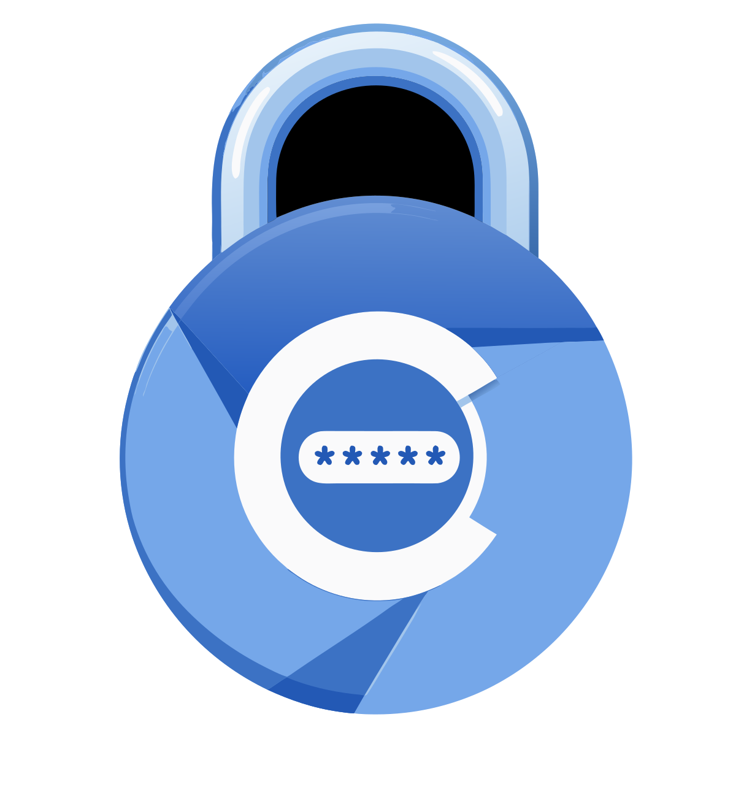

# 🔒 Browser Lock — Privacy-First Chrome Profile Security

<div align="center">
  
  <h3>Modern, Airtight, 100% Offline Profile Lock for Google Chrome</h3>
  <p>Protect your tabs, history, and active session with military-grade PBKDF2 encryption and offline Google Authenticator 2FA recovery.</p>

  <p>
    
    
    
    
  </p>
</div>

---

## 🌟 Key Features

- 🛡️ **Airtight Startup & Instant Lock:** Automatically minimizes and locks your browsing session when Chrome opens or when triggered manually (`Ctrl+Shift+Z`).
- 🕶️ **Windows Taskbar Peek Privacy:** Prevents desktop shoulder-surfers from previewing tabs in the Windows taskbar thumbnail peek by rendering an instant solid-black fullscreen canvas before minimizing.
- 🔐 **PBKDF2-SHA256 PIN Encryption:** 600,000 iterations (OWASP recommended standard) with unique 16-byte cryptographically random salt per profile.
- 📱 **Offline 2FA Recovery (Google Authenticator):** Standard RFC 6238 TOTP engine built right in with an offline SVG QR Code generator. No SMS, no emails, no servers.
- 💾 **Binary Key File & Manual Key Backup:** Save a local raw key file or copy your Base32 secret string to recover your profile if you ever lose your phone.
- ⏱️ **Brute-Force Attack Prevention:** Exponential lockout timers after consecutive failed PIN attempts.
- ⚡ **Auto-Lock on Inactivity:** Optional auto-lock timer when stepping away from your computer.
- 🌐 **100% Offline & Open Source:** Zero analytics, zero telemetry, zero tracking, zero third-party scripts.

---

## 🚀 Installation

### Option 1: Chrome Web Store (Recommended)
Install directly from the [Chrome Web Store](https://chrome.google.com/webstore).

### Option 2: Load Unpacked (Developer Mode)
1. Clone or download this repository:
   ```bash
   git clone https://github.com/your-username/browser-lock.git
   ```
2. Open Google Chrome and navigate to `chrome://extensions`.
3. Enable **Developer mode** toggle in the top right corner.
4. Click **Load unpacked** and select the root folder of this repository.
5. The Browser Lock setup screen will open immediately.

---

## 🔒 Security & Cryptographic Architecture

| Layer | Implementation | Details |
|---|---|---|
| **PIN Hash Function** | PBKDF2 (HMAC-SHA-256) | 600,000 rounds via standard Web Crypto API |
| **Salt Generation** | `crypto.getRandomValues()` | 16-byte cryptographically secure random salt |
| **Hash Verification** | Constant-time XOR comparison | Resistant to side-channel timing attacks |
| **2FA Recovery** | RFC 6238 TOTP (HMAC-SHA-1) | Compatible with Google Authenticator, Authy, Aegis, 1Password |
| **Storage Security** | `chrome.storage.local` | Sandboxed to this extension profile only; never synchronized across devices |

---

## 🔑 Permissions Breakdown

Browser Lock follows the principle of least privilege:

| Permission | Purpose |
|---|---|
| `storage` | Stores PIN hash, salt, TOTP secret, and user settings strictly in local isolated extension storage. |
| `alarms` | Schedules brute-force lockout and inactivity auto-lock timers. |
| `identity` / `identity.email` | Reads the local profile's signed-in Google account email to automatically label the Google Authenticator entry (e.g. `BrowserLock (user@gmail.com)`). Never sent to any server. |
| `idle` *(Optional)* | Detects system idle state if the user enables the inactivity timer in Settings. |

---

## 📄 Privacy Policy

Browser Lock is designed with strict **zero-knowledge privacy**:
- No personal data, browsing history, cookies, or credentials are ever collected or transmitted.
- Read our full [Privacy Policy](privacy.html).

---

## 📜 License

This project is licensed under the [MIT License](LICENSE).
